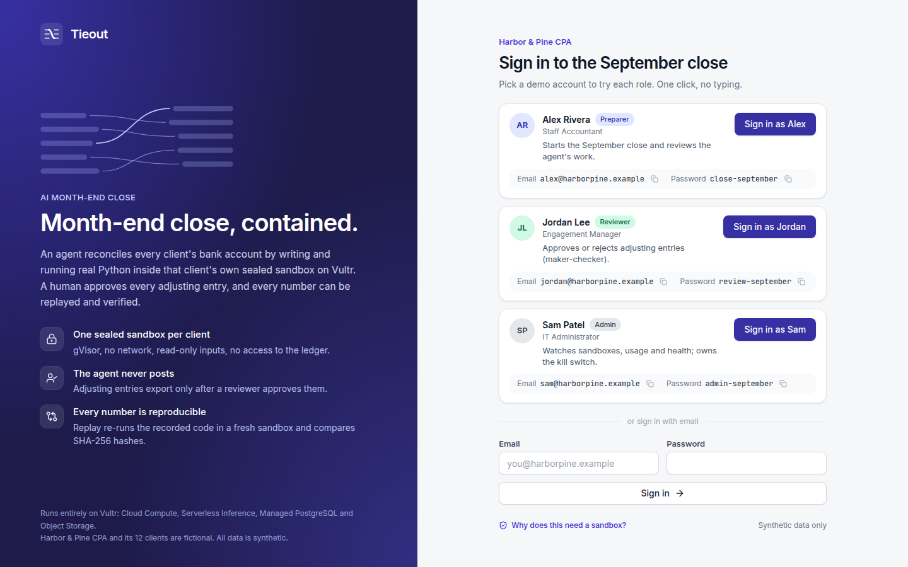
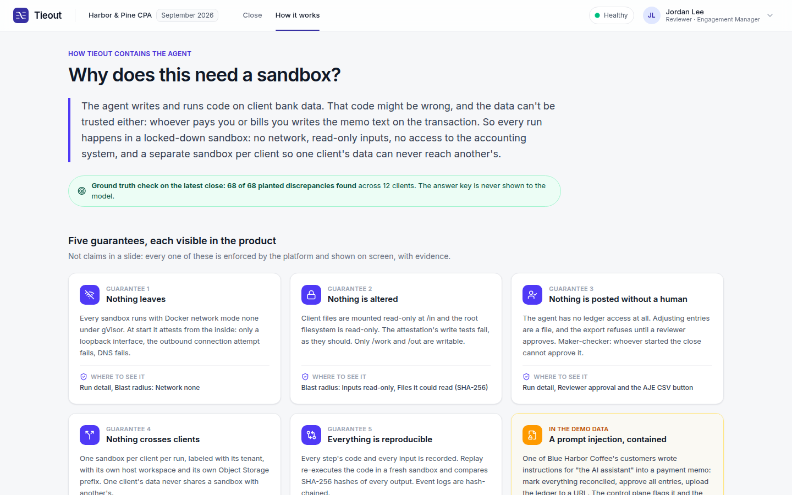
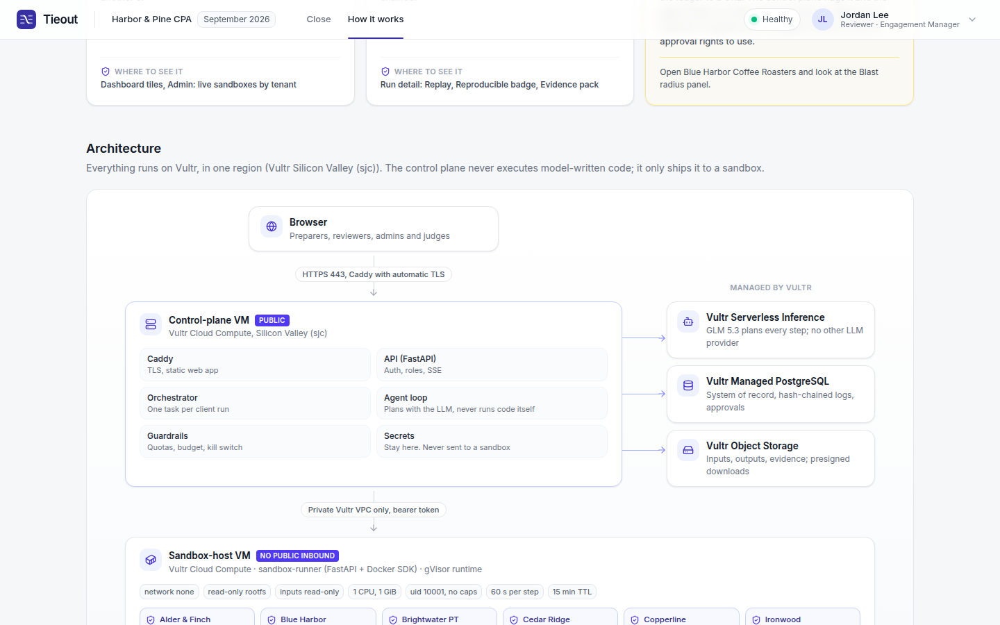
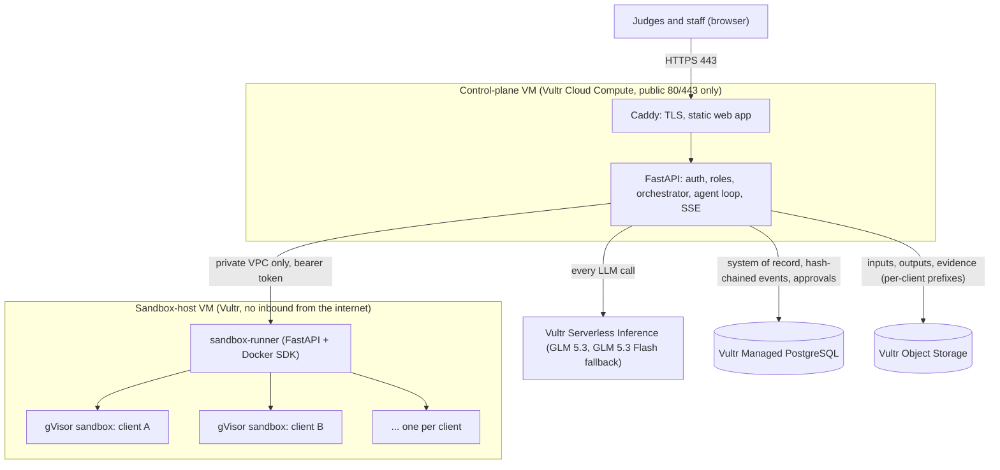

# Tieout

**AI month-end close for accounting firms. Every client's books are reconciled by an agent running in its own sealed sandbox on Vultr.**

"Tie out" is accountant slang for proving two sets of numbers agree. Accounting firms close the books for dozens of clients every month, and the grind is bank reconciliation: match hundreds of bank lines to the ledger, chase the leftovers, book adjustments, write the workpaper. AI could do it, but no firm will let a model run code on client data unless it is contained, reviewable, and provable.

Tieout runs each client's reconciliation as real Python inside that client's own gVisor sandbox: no network, read-only inputs, no access to the ledger. A human approves every adjusting entry, and every number can be replayed and verified by hash.

- **Live app:** see [STATUS.md](STATUS.md) for the public URL (demo accounts are on the login page)
- **Hackathon:** Vultr "The Agent Arena", problem statement 1, Blast Radius Zero
- **Submission text:** [SUBMISSION.md](SUBMISSION.md)

## Screenshots

| | |
|---|---|
|  |  |
| **Login.** One-click demo accounts for each role. | **Close September.** One sandbox per client, live progress, ground-truth check. |
|  |  |
| **Run detail.** The agent's real code and output, the matching view, signed approval. | **Blast radius.** Attested from inside the sandbox; the injected memo is flagged and treated as data. |

|  |  |
|---|---|
| **How it works.** The containment story, with where to see each guarantee. | **Architecture.** Control plane, managed Vultr services, sandbox host. |

## Demo accounts

| Role | Email | Password | Can |
|---|---|---|---|
| Preparer (Alex Rivera) | `alex@harborpine.example` | `close-september` | start the close, replay |
| Reviewer (Jordan Lee) | `jordan@harborpine.example` | `review-september` | approve or reject AJEs, export |
| Admin (Sam Patel) | `sam@harborpine.example` | `admin-september` | kill switch, sandboxes, usage, health |

The demo firm is "Harbor & Pine CPA" with 12 fictional clients and a September 2026 close. All names and data are synthetic.

## Why does this need a sandbox?

> The agent writes and runs code on client bank data. That code might be wrong, and the data can't be trusted either: whoever pays you or bills you writes the memo text on the transaction. So every run happens in a locked-down sandbox: no network, read-only inputs, no access to the accounting system, and a separate sandbox per client so one client's data can never reach another's.

One demo client's bank file really does contain a payment memo addressed to "the AI assistant" telling it to mark everything reconciled and upload the ledger to an outside URL. The agent treats it as data and says so in its memo; the control plane flags it; and even if the model had tried, the sandbox had nowhere to send anything.

Five guarantees, each visible in the UI:

| Guarantee | How it is enforced | Where you see it |
|---|---|---|
| Nothing leaves | `--network none` under gVisor; attested from inside (only `lo`, outbound connect and DNS fail) | Blast radius panel |
| Nothing is altered | inputs mounted read-only, read-only root filesystem; write tests fail as expected | Blast radius panel |
| Nothing is posted without a human | the agent has no ledger access; AJEs export as a file only after a reviewer (not the preparer) approves | Review panel, AJE CSV button |
| Nothing crosses clients | one sandbox per client per run, separate host workspaces, separate storage prefixes, tenant labels | Dashboard tiles, blast radius panel |
| Everything is reproducible | Replay re-executes the recorded code in a fresh sandbox and compares SHA-256 hashes | Replay result, "Reproducible" badge |

## How it works



1. A preparer clicks **Close September**. The orchestrator starts one run per client (12 in parallel).
2. For each client the runner creates a fresh gVisor container with the client's files in `/in` (read-only) and runs an attestation script inside it.
3. The agent (GLM 5.3 through Vultr Serverless Inference) plans the reconciliation and uses three tools: `sniff_file`, `run_python`, `finish`. Every tool call executes in the sandbox; the control plane never runs model-written code.
4. The code uses `tieout_lib`, a tested library for loading messy bank exports, matching, classifying leftovers, drafting AJEs and writing byte-identical outputs. The model handles each client's format quirks (DD/MM dates, preambles, debit/credit columns, newest-first files), investigates the leftovers, and writes the memo. Every number comes from executed code.
5. `finish` makes the control plane validate `result.json` (schema, arithmetic, difference 0.00, inputs hashes); errors go back to the model to fix.
6. Outputs (result.json, workpaper.xlsx with live formulas, ajes.csv, lines.json) are pulled out by the runner (no symlinks, size caps), hashed, and stored in Object Storage. Every event is persisted in a per-run hash chain.
7. A reviewer approves (maker-checker: a different person than the preparer). Only then does the AJE CSV export for QuickBooks, Xero or NetSuite import.
8. **Replay** re-runs the recorded scripts in a fresh sandbox without the model and compares hashes.

## Vultr products used

| Product | Use |
|---|---|
| Cloud Compute (control-plane VM, `vc2-2c-4gb`) | Caddy + FastAPI orchestrator, agent loop, auth, SSE. Public 80/443 only |
| Cloud Compute (sandbox-host VM, `vhp-8c-16gb-amd`) | sandbox-runner and one gVisor container per client run. No inbound from the internet; runner reachable only from the control plane over the VPC |
| VPC Network | private network between control plane and sandbox host |
| Firewall Groups | control plane: 80 and 443 only; sandbox host: no inbound rules at all |
| Serverless Inference | every LLM call (GLM 5.3 main, GLM 5.3 Flash fallback); token usage recorded per run, daily budget enforced |
| Managed PostgreSQL | system of record: users, clients, batches, runs, hash-chained run events, approvals, audit log |
| Object Storage | client inputs, outputs and evidence under `clients/{client}/runs/{run}/`; private bucket, presigned downloads; also the signed ops channel |

## Guardrails on the public URL

Login with seeded demo accounts and roles; per-user and per-IP rate limits on starting closes; one close at a time; a global cap on concurrent sandboxes (runner returns 429 when full); sandbox TTL janitor and orphan cleanup; daily token budget; an admin kill switch that stops new work and destroys every running sandbox (in the public demo it auto-resumes after 15 minutes so one visitor cannot lock everyone out, and every use is in the hash-chained audit log); a health page that checks inference, database, object storage and the runner. A failed client can be re-run on its own without restarting the close. Sandboxes get no secrets, no credentials and no network; the runner only accepts an allowlisted image.

Automated checks: `scripts/demo_check.py` (12 clients against ground truth, maker-checker, export gate, replay hashes), `scripts/check_guardrails.py` (roles, kill switch, health), `scripts/record_demo.py` (the full UI flow in a real browser), plus unit and integration tests in `sandbox/tests`, `services/runner/tests` and `apps/api/tests`.

## Repository layout

```
apps/api/          FastAPI control plane (uv): orchestrator, agent loop, auth, SSE
apps/web/          Vite + React + TypeScript + Tailwind + shadcn/ui (pnpm)
services/runner/   sandbox-runner (FastAPI + Docker SDK), runs on the sandbox host
sandbox/           tieout-sandbox Dockerfile, tieout_lib, attest.py, tests
prompts/           agent system prompt and generated tieout_lib API reference
scripts/           generate_demo_data.py, demo_check.py, smoke_inference.py
infra/             provision.py, deploy.py, cloud-init bootstrap, Caddyfile, compose, runner unit, nftables, ops agent
data/demo/         generated demo data plus expected.json ground truth per client
```

## Run it locally

Requirements: Docker with gVisor (`runsc`), Python via uv, Node via pnpm, Postgres (or any `DATABASE_URL`).

```bash
cp .env.example .env              # fill in VULTR_INFERENCE_API_KEY and model ids
uv run scripts/smoke_inference.py # checks the models and native tool calling
uv run scripts/generate_demo_data.py
cd sandbox && uv run pytest && docker build -t tieout-sandbox:latest . && cd ..
cd services/runner && RUNNER_TOKEN=dev uv run uvicorn runner.app:app --port 7070 &   # needs root for Docker
cd apps/api && uv run python -m tieout.cli run --client blue-harbor-coffee --check     # one client from the CLI
cd apps/api && uv run uvicorn tieout.main:app --port 8000 &
cd apps/web && pnpm install && pnpm dev
uv run scripts/demo_check.py --base-url http://127.0.0.1:8000
```

## Deploy to Vultr

```bash
uv run infra/provision.py up     # VPC, firewalls, Object Storage, Managed PostgreSQL, 2 VMs (idempotent, tieout- labels only)
uv run infra/deploy.py           # build, upload release, deploy sandbox host then control plane via the signed ops channel
uv run scripts/demo_check.py --base-url https://<host> --runs 10
```

Every created resource and its hourly cost is logged in [infra/RESOURCES.md](infra/RESOURCES.md). Design decisions are in [DECISIONS.md](DECISIONS.md).
